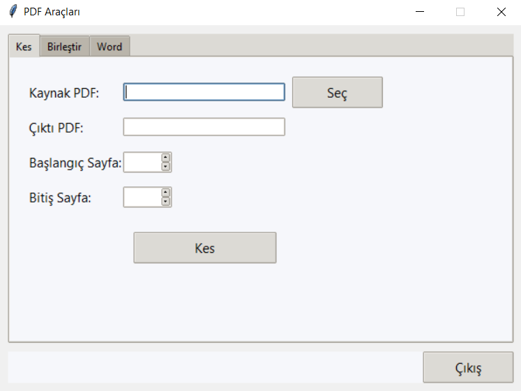

# PDF Araçları (Tkinter GUI)

Basit, hafif ve tamamen **Python** ile yazılmış bir masaüstü uygulaması:

PDF dosyalarını **kesme**, **birleştirme** ve **Word (.docx) çıktısına dönüştürme** işlemlerini tek pencerede sunar.

PyInstaller ile paketlenmiş `pdf-tools.exe` (zip içinde) dosyasını indirip doğrudan çalıştırabilirsiniz ek kurulum gerekmez.

---

## Özellikler

İşlev Açıklama

- **PDF Kes**: Sayfa aralığı seç, yeni PDF oluştur.
- **PDF Birleştir**: İki PDF’i sıralı olarak tek dosyada birleştir.

- **PDF → Word**: Tüm sayfalardaki metni çıkar, `.docx` dosyasına
  kaydet.

- **Tek sekmeli arayüz**: “Kes / Birleştir / Word” sekmeleri + çıkış
  düğmesi.

- **Hata koruması**: Geçersiz sayfa aralığı, eksik dosya seçimi vb.
  durumlarda uyarı kutuları.

---

## Ekran Görüntüsü

> 

---

## Hızlı Başlangıç

### 1) .exe dosyasını indir ve çalıştır

Zİp içindeki **`pdf-tools.exe`** dosyasını alın, çift tıklayın.

### 2) Kaynak koddan çalıştır

Aynı dosya dizininde

```bash

git  clone

pip  install  -r  requirements.txt

python  app.py

```
